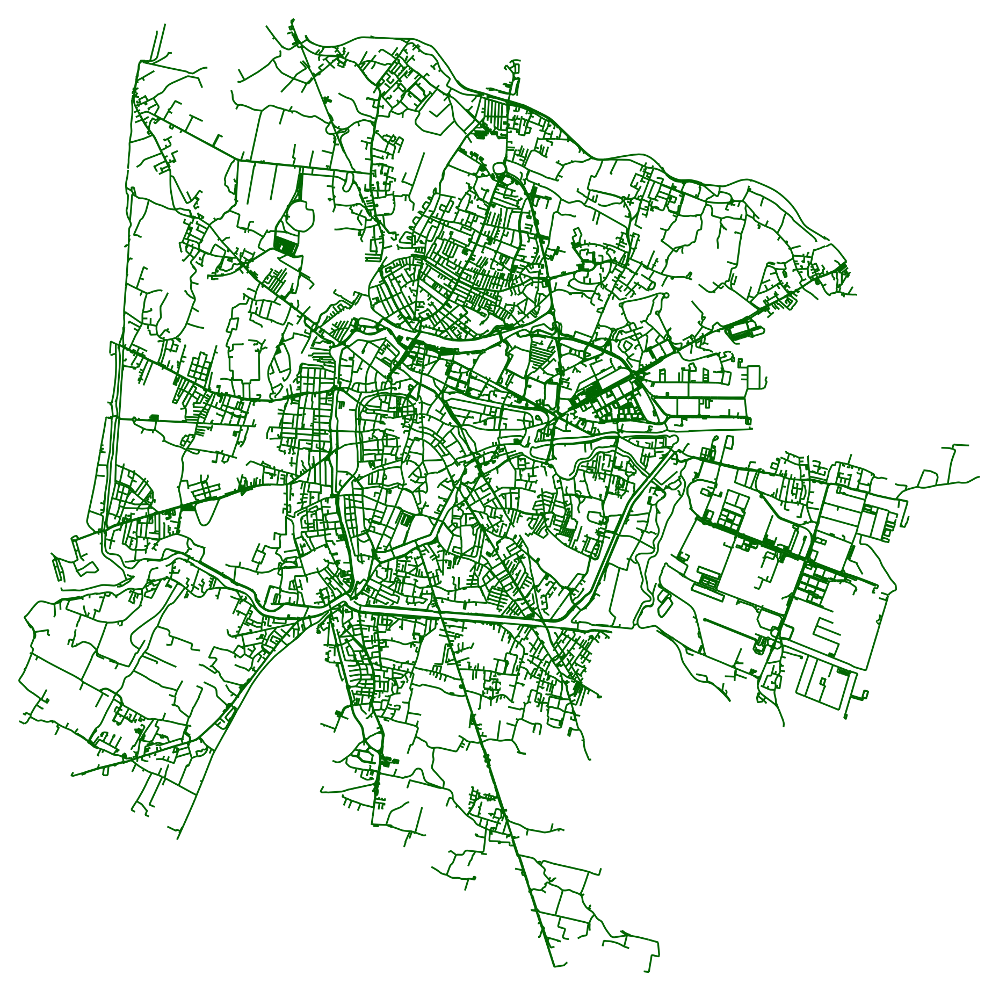
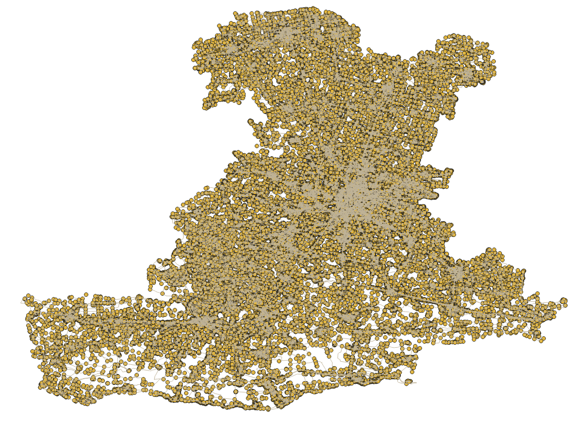

# Padua_Network_dataset_2025
Datasets containing the roads and walkable paths of the province and the city of Padua, obtained by using open available data from Open Street Map, 2025.
 
## The datasets

## Code
 

 
## Data License and Attribution
The dataset contained in this repository is released under the Open Data Commons Open Database License (ODbL) v1.0. The data used for this dataset derives from OpenStreetMap, and it is openly available under the Open Database License (ODbL). For the full and readable version of the license, please refer to the [LICENSE file](LICENSE).
