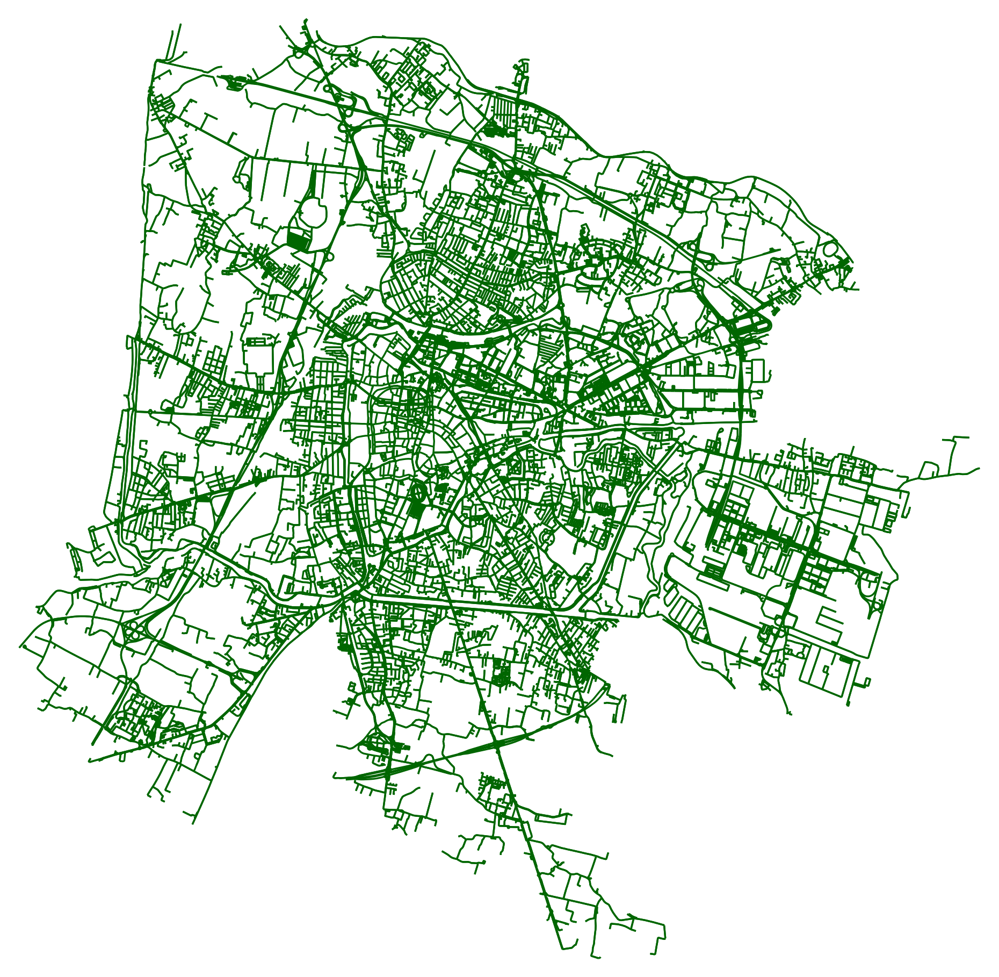
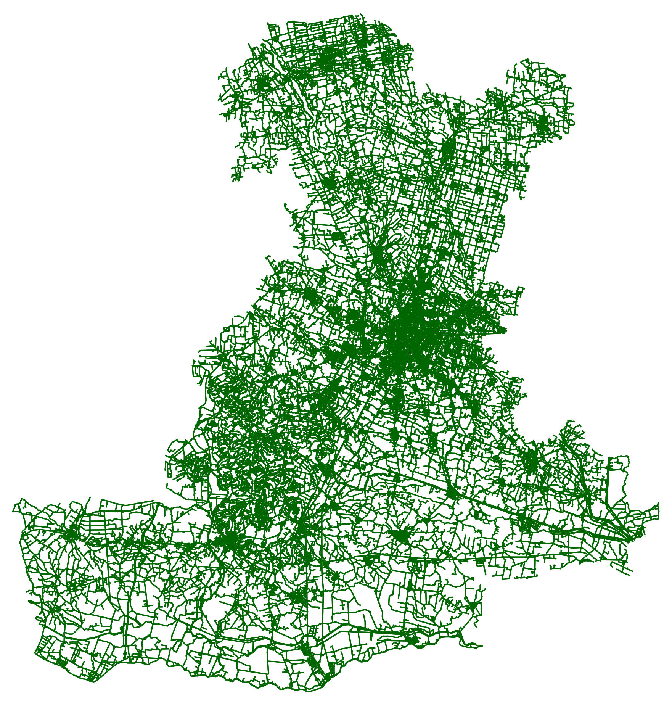

# Padua_Network_dataset_2025

Datasets containing all drivable roads and walkable paths of the province and the city of Padua, Italy, obtained by using openly available data from Open Street Map, 2025.
 
## Datasets
The datasets include all the drivable and walkable paths of the province and city of Padua, Italy, in 2025. Each dataset is available as one .gpkg file or, equivalently, as 2 .csv files: the first one is a list of all nodes of the graph, the second one contains all edges. The datasets are bundled inside the [data_province.zip](/data_province.zip) and [data_city.zip](/data_city.zip) archives.

 

  <b>Figura 1:</b> plot of all drivable and walkable roads in the province of Padova, Italy. Number of nodes: 122.728; number of edges: 304.184.

 

  <b>Figura 2:</b> Plot of all drivable and walkable roads in the city of Padova, Italy. Number of nodes: 25.223; number of edges: 63.298.

## Code

Run the Python program [getMapData.py](src/getMapData.py) and write the name of the location from which you want to obtain the OSM data. The result will be a .gpkg package saved in the current directory, with all drivable and walkable roads contained in the specified location. The .gpkg file can also be converted to 2 .csv files similar to the ones inside the [data_province.zip](/data_province.zip) and [data_city.zip](/data_city.zip) archives.

### Requirements to run the program
* The OSMnx Python package: enables communication with the OSM API.
* Matplotlib: to save a plot of the network.
 
## Data License and Attribution
The dataset contained in this repository is released under the Open Data Commons Open Database License (ODbL) v1.0. The data used for this dataset derives from OpenStreetMap, and it is openly available under the Open Database License (ODbL). For the full and readable version of the license, please refer to the [LICENSE file](LICENSE).
